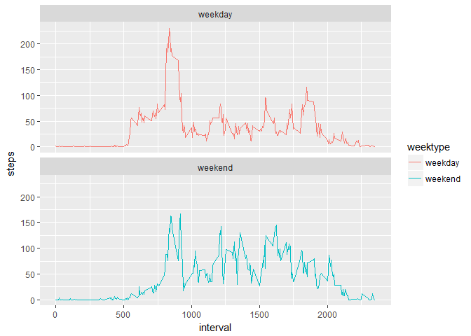

# Reproducible Research: Peer Assessment 1
Wardil Tsoi  


## Introdution

This assignment makes use of data from a personal activity monitoring device. This device collects data at 5 minute intervals through out the day. The data consists of two months of data from an anonymous individual collected during the months of October and November, 2012 and include the number of steps taken in 5 minute intervals each day.

This documentation presents the requirements and explains steps/codes needed to reproduce the intended results, written in a R markdown file then processed by using knitr to transformed into an HTML file

## Setting the global option
This code is used to allow code being displayed throughout the  whole documentation


```r
library(knitr)
library(ggplot2)
opts_chunk$set(echo=TRUE)
```

## Set the directory where the file exists and reading required file

Setting up the correct working directory so file can be read


```r
setwd("D:/Users/tsoiwa/RepData_PeerAssessment1/activity/")
data <- read.csv("activity.csv", header = TRUE, sep = ',', colClasses = c("numeric","character","integer"))
```

## Create  a histogram of total number taken each day and Calculate  the mean

Create a histogram by

1. Change the date variable from character to proper date format
2. group the data by date
3. create a histogram base on newly group data
4. Calculate the mean and median of the number of steps taken


```r
library (lubridate)
```

```
## Warning: package 'lubridate' was built under R version 3.4.1
```

```
## 
## Attaching package: 'lubridate'
```

```
## The following object is masked from 'package:base':
## 
##     date
```

```r
data$date <- ymd(data$date)
data1 <- aggregate(steps~date,data,sum)
hist(data1$steps, main = "Total Number of Steps Taken per Day", col = "green", xlab = "Number of Steps")
```

<!-- -->

## Calculate Mean and Median


```r
steps_mean <- mean(data1$steps)
steps_median <- median(data1$steps)
```

The mean for the number of steps taken each day is 1.0766189\times 10^{4} and the median is 1.0765\times 10^{4}

## Create a time series plot of average number of steps taken

1. Group data by interval and calculate the mean of the steps
2. plot data using line graph by setting the graph type to "l"
3. Calculate the maximum numbers of steps for the 5-minute interval


```r
data2 <- aggregate(steps~interval,data,mean)
plot(data2$interval,data2$steps, type = "l", xlab = "Interval", ylab = "Number of Steps", main = "Average Number of Steps Taken")
```

<!-- -->

```r
max_int <- data2[which.max(data2$steps),1]
```
The 5-minute interval, on average, contains 835 maximum number of steps

## Imputing missing values

There are a number of days/intervals where there are missing values (coded as NA). The presence of missing days may introduce bias into some calculations or summaries of the data. Therefore, it is necessary to create a strategy to handle the missing value.

1. Calculate Calculate and report the total number of missing values in the dataset (i.e. the total number of rows       with NAs)
2. Use the mean/median for that day, or the mean for that 5-minute interval, to replace the NAs values
3. Create a new dataset that is equal to the original dataset but with the missing data filled in.
4. Create a histogram of the total number of steps taken each day and Calculate and report the mean and median total     number of steps taken per day and see any difference to the  first part of the assignment and the impact ofimputing    missing data on the estimates of the total daily number of steps


```r
NumNA <- sum(is.na(data$steps))
data3 <- data
data3$steps[is.na(data3$steps)] <- tapply(data3$steps,data3$interval,mean,na.rm=TRUE,simplify = TRUE)
```

Total missing NA values are 2304


```r
myCleanData <- aggregate(steps~date,data3,sum)
hist(myCleanData$steps, main = "Total Steps per Day", col = "red", xlab = "Number of Steps")
```

<!-- -->

```r
NewSteps_mean <- mean(myCleanData$steps)
NewSteps_median <- median(myCleanData$steps)
diff1 <- NewSteps_mean - NewSteps_median
diff2 <- sum(myCleanData$steps)-sum(data1$steps)
med_diff <- NewSteps_median - steps_median
```

1. The is no different between the median and the mean for data with NAs values imputed with both the mean and the median have a value of 1.0766189\times 10^{4}.

2. The median differences between new and old data is 1.1886792

3. The number of steps per day taken on the new data is 6.5673751\times 10^{5} and the on the old data is 5.70608\times 10^{5}. Thus, number of steps per day increased by 8.6129509\times 10^{4}

## Are they any difference in activity patterns between weekdays and weekends

Comparing the activity patterns during weekdays and weekends requires
1. converting the current dates into weekdays and weekends
2. grouping these activities by the new date variables and interval
3. plot these two graphs for comparison


```r
data3$weektype <- ifelse(weekdays.Date(data3$date)=="Saturday"|weekdays.Date(data3$date)=="Sunday","weekend","weekday")
weekend_activity <- aggregate(steps~interval+weektype,data3,mean)
ggplot(weekend_activity, aes(x=interval,y=steps,color=weektype))+geom_line()+facet_wrap(~weektype,ncol=1,nrow=2)
```

<!-- -->

Comparing the two graphs above, there are visible differences between weekdays and weekend, in a sense that the during the weekend, there are more consistent activities throughout the day as supposed to only some increase activities during certain time in the weekday.
